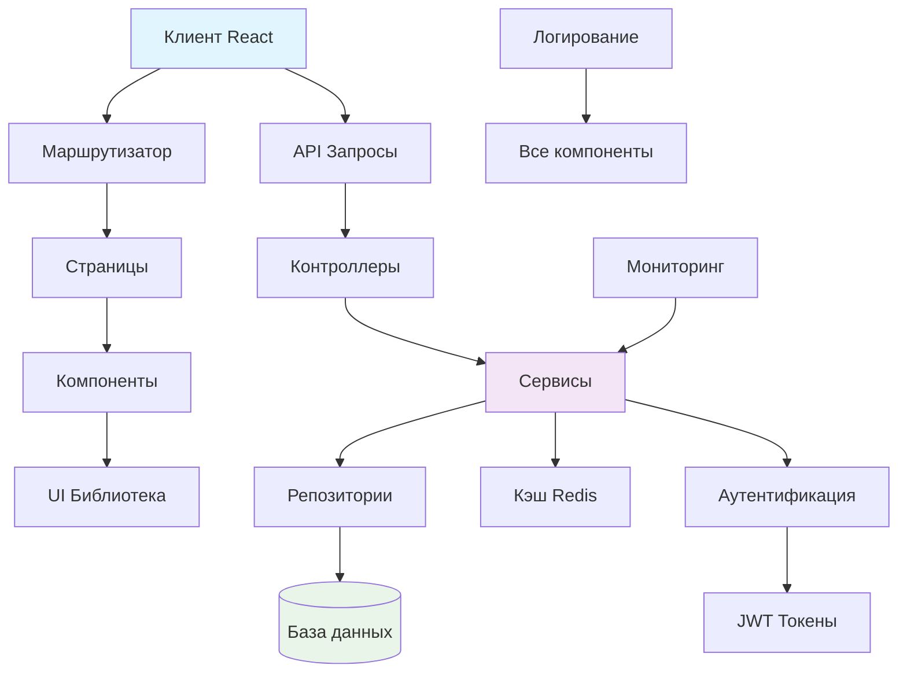

# Архитектурный анализ QuestTrip-App

## Текущая архитектура

### Обзор
QuestTrip-App - это веб-приложение для создания и прохождения квестов с клиент-серверной архитектурой:

- **Клиент**: React + TypeScript + Vite + Tailwind CSS
- **Сервер**: Express.js + TypeScript
- **База данных**: SQLite с Drizzle ORM
- **Аутентификация**: JWT токены
- **Маршрутизация**: Wouter (клиент), Express (сервер)

### Структура проекта
```
questtrip-app/
├── client/                 # React фронтенд
│   ├── src/
│   │   ├── components/    # Общие компоненты
│   │   ├── components/shared/ # Дублирующие компоненты
│   │   ├── components/ui/ # UI компоненты (shadcn/ui)
│   │   ├── pages/         # Страницы приложения
│   │   ├── hooks/         # Кастомные хуки
│   │   └── lib/           # Утилиты, клиенты API
├── server/                # Express бэкенд
│   ├── index.ts          # Инициализация сервера
│   ├── routes.ts         # API маршруты
│   ├── storage.ts        # Работа с БД
│   └── static.ts         # Статические файлы
├── shared/               # Общая схема БД
└── script/              # Скрипты сборки
```

## Выявленные проблемы

### 1. Дублирование компонентов
**Проблема**: В проекте существует дублирование компонентов:
- `client/src/components/` и `client/src/components/shared/` содержат одинаковые файлы
- Это приводит к избыточности и сложностям поддержки

### 2. Отсутствие слоя сервисов
**Проблема**: Вся бизнес-логика сосредоточена в `routes.ts` и `storage.ts`
- Смешение ответственности (маршрутизация + бизнес-логика)
- Сложность тестирования
- Нарушение принципа единственной ответственности

### 3. Прямые SQL-запросы в storage.ts
**Проблема**: Используются raw SQL для создания таблиц вместо миграций
- Отсутствие системы миграций
- Сложность изменения схемы БД
- Риск потери данных при обновлениях

### 4. Отсутствие валидации входных данных
**Проблема**: Минимальная валидация на уровне API
- Используются схемы Zod только для типизации
- Нет комплексной валидации бизнес-правил

### 5. Проблемы с безопасностью
**Проблема**:
- JWT секрет по умолчанию в коде
- Отсутствие rate limiting
- Нет защиты от CSRF/XSS атак
- Пароли хранятся без дополнительных мер защиты

### 6. Отсутствие кэширования
**Проблема**: Нет кэширования часто запрашиваемых данных
- Квесты, пользовательские данные запрашиваются каждый раз
- Высокая нагрузка на БД при росте пользователей

### 7. Монолитная структура сервера
**Проблема**: Весь сервер в одном файле `routes.ts` (306 строк)
- Сложность навигации
- Высокая связанность кода
- Сложность масштабирования

## Предлагаемые улучшения

### 1. Рефакторинг структуры компонентов
**Решение**: Убрать дублирование, создать четкую иерархию
```
client/src/components/
├── ui/           # Базовые UI компоненты (shadcn)
├── layout/       # Компоненты макета
├── quest/        # Компоненты квестов
├── auth/         # Компоненты аутентификации
└── shared/       # Общие утилитарные компоненты
```

### 2. Внедрение слоя сервисов
**Решение**: Создать сервисный слой для бизнес-логики
```
server/
├── services/
│   ├── auth.service.ts
│   ├── quest.service.ts
│   ├── user.service.ts
│   └── payment.service.ts
├── controllers/  # Только маршрутизация
└── repositories/ # Работа с БД
```

### 3. Внедрение системы миграций
**Решение**: Использовать Drizzle Kit для миграций
- Создать миграции для существующих таблиц
- Настроить автоматическое применение миграций
- Добавить скрипты для отката изменений

### 4. Усиление валидации
**Решение**:
- Расширить Zod схемы для полной валидации
- Добавить middleware для валидации запросов
- Внедрить классы DTO (Data Transfer Objects)

### 5. Улучшение безопасности
**Решение**:
1. **Environment variables**: Вынести секреты в .env
2. **Helmet.js**: Добавить security headers
3. **Rate limiting**: Внедрить express-rate-limit
4. **CORS**: Настроить правильно для production
5. **Хеширование паролей**: Использовать bcrypt с солью

### 6. Внедрение кэширования
**Решение**:
- Redis для сессий и кэширования
- Кэширование популярных квестов
- Инвалидация кэша при изменениях

### 7. Модульная архитектура сервера
**Решение**: Разделить routes.ts на модули
```
server/routes/
├── auth.routes.ts
├── quest.routes.ts
├── user.routes.ts
├── admin.routes.ts
└── index.ts (объединение)
```

### 8. Добавление мониторинга и логирования
**Решение**:
- Winston для структурированного логирования
- Sentry для отслеживания ошибок
- Метрики производительности

### 9. Улучшение обработки ошибок
**Решение**: Единый обработчик ошибок
- Классификация ошибок (валидация, бизнес, системные)
- Стандартизированные ответы API
- Логирование ошибок с контекстом

### 10. Оптимизация производительности
**Решение**:
- Пагинация для списков квестов
- Lazy loading для изображений
- Code splitting для React компонентов
- CDN для статических ресурсов

## Приоритеты реализации

### Высокий приоритет (неделя 1-2)
1. Убрать дублирование компонентов
2. Вынести секреты в .env файл
3. Добавить систему миграций
4. Разделить routes.ts на модули

### Средний приоритет (неделя 3-4)
5. Внедрить сервисный слой
6. Усилить валидацию
7. Добавить обработку ошибок
8. Внедрить базовое кэширование

### Низкий приоритет (неделя 5+)
9. Полная система безопасности
10. Мониторинг и логирование
11. Оптимизация производительности
12. Расширенное кэширование

## Диаграмма предлагаемой архитектуры



## Ожидаемые результаты

1. **Улучшение поддерживаемости**: Четкое разделение ответственности
2. **Повышение безопасности**: Защита от распространенных атак
3. **Улучшение производительности**: Кэширование и оптимизация
4. **Упрощение разработки**: Модульная структура
5. **Готовность к масштабированию**: Возможность горизонтального масштабирования

## Следующие шаги

1. Обсудить предложения с командой
2. Создать детальный план реализации
3. Начать с высокоприоритетных задач
4. Поэтапно внедрять изменения
5. Тестировать каждое изменение